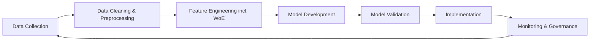
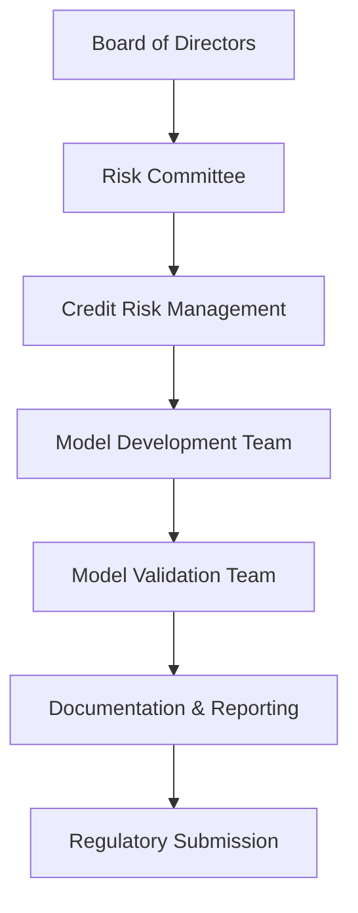

# Credit-Risk-Probability-Model-for-Alternative-Data

# 📘 Credit Scoring Project

A fully documented credit-scoring model aligned with Basel II regulatory standards.  
This project covers end-to-end development: data preparation, proxy target creation, modeling, validation, governance, and documentation.

---

## 📑 Table of Contents
- [Credit-Risk-Probability-Model-for-Alternative-Data](#credit-risk-probability-model-for-alternative-data)
- [📘 Credit Scoring Project](#-credit-scoring-project)
  - [📑 Table of Contents](#-table-of-contents)
- [Project Overview](#project-overview)
- [Credit Scoring Business Understanding](#credit-scoring-business-understanding)
  - [1. Influence of Basel II on Model Interpretability and Documentation](#1-influence-of-basel-ii-on-model-interpretability-and-documentation)
    - [🧩 Key Basel II Requirements Influencing Modeling](#-key-basel-ii-requirements-influencing-modeling)
      - [✔ Transparency and Explainability](#-transparency-and-explainability)
      - [✔ Documentation and Auditability](#-documentation-and-auditability)
      - [✔ Ethical and Fair-Lending Requirements](#-ethical-and-fair-lending-requirements)
  - [2. Need for a Proxy Variable When No Direct Default Label Exists](#2-need-for-a-proxy-variable-when-no-direct-default-label-exists)
    - [🔍 Why We Must Create a Proxy](#-why-we-must-create-a-proxy)
    - [⚠ Business Risks of Using Proxy Defaults](#-business-risks-of-using-proxy-defaults)
      - [1️⃣ Misalignment With True Default Behavior](#1️⃣-misalignment-with-true-default-behavior)
      - [2️⃣ Bias Introduction](#2️⃣-bias-introduction)
      - [3️⃣ Regulatory Defensibility Issues](#3️⃣-regulatory-defensibility-issues)
      - [4️⃣ Impact on Portfolio Strategies](#4️⃣-impact-on-portfolio-strategies)
  - [3. Trade-offs Between Interpretable and Complex Models in a Regulated Environment](#3-trade-offs-between-interpretable-and-complex-models-in-a-regulated-environment)
    - [🔵 Interpretable Models (Logistic Regression + WoE)](#-interpretable-models-logistic-regression--woe)
    - [🔴 Complex Models (Gradient Boosting, XGBoost, Random Forests)](#-complex-models-gradient-boosting-xgboost-random-forests)
    - [⚖ The Real-World Compromise](#-the-real-world-compromise)
- [Diagrams](#diagrams)
  - [1. PD Modeling Lifecycle](#1-pd-modeling-lifecycle)

---

# Project Overview

The objective of this project is to build a **credit scoring model** that predicts the probability that a borrower may default.  
Because financial institutions operate under strict regulatory frameworks (Basel II/III), the model must be:

- Transparent  
- Interpretable  
- Fair and non-discriminatory  
- Well-documented  
- Validated and monitored  

This repository includes all components needed to demonstrate a regulatory-grade credit scoring pipeline.

---

# Credit Scoring Business Understanding

## 1. Influence of Basel II on Model Interpretability and Documentation

The **Basel II Accord** establishes standards for credit risk measurement under Internal Ratings–Based (IRB) approaches.  
Its emphasis on **risk governance** directly shapes how credit scoring models must be built and documented.

### 🧩 Key Basel II Requirements Influencing Modeling

#### ✔ Transparency and Explainability
Basel II requires that:
- Each variable must have a defensible relationship to default risk.
- Model behavior must be interpretable for regulators, auditors, and credit officers.
- No “black box” decision-making can be used for regulatory capital calculations.

#### ✔ Documentation and Auditability
Institutions must maintain:
- Full data lineage documentation  
- Justification for feature engineering (e.g., WoE binning, monotonicity)  
- Detailed modeling assumptions  
- Validation reports (KS, ROC, Gini, PSI, calibration)  
- Stress testing results  
- Model monitoring framework  

#### ✔ Ethical and Fair-Lending Requirements
Models must:
- Avoid hidden bias  
- Produce consistent decisions across customer groups  
- Be explainable and defensible  

**Conclusion:**  
Basel II strongly favors **logistic regression + WoE** or similarly interpretable approaches.

---

## 2. Need for a Proxy Variable When No Direct Default Label Exists

The dataset does **not** include a direct “default” column (e.g., `default_flag`).  
But supervised models *require* a target variable.

### 🔍 Why We Must Create a Proxy
To train a PD model, we need to define what “default” means.  
Possible proxy definitions include:
- 90+ days past due  
- 3+ consecutive missed payments  
- Account written off  
- Assigned to collections  

Without a proxy:
- We cannot train or validate the model  
- No risk segmentation is possible  
- The PD model cannot be operationalized  

### ⚠ Business Risks of Using Proxy Defaults

#### 1️⃣ Misalignment With True Default Behavior
If the proxy does not reflect actual defaults:
- Non-risky customers may be rejected  
- Risky customers may be approved (leading to financial loss)  

#### 2️⃣ Bias Introduction
Proxies may unintentionally reflect:
- Operational issues  
- Customer behavior not linked to credit risk  
- Socioeconomic artifacts  

This can introduce **fairness and compliance risks**.

#### 3️⃣ Regulatory Defensibility Issues
Regulators can challenge:
- Why the proxy definition was chosen  
- Whether it reflects industry standards  
- Its statistical robustness  

#### 4️⃣ Impact on Portfolio Strategies
A poor proxy can distort:
- PD estimation  
- Risk-based pricing  
- Capital requirements (RWA)  
- Write-off policies  

---

## 4. Proxy Target Variable Engineering Implementation

This project implements a **RFM-based proxy target variable** to identify high-risk customers from transactional behavior patterns.

### 📊 Methodology

The proxy target variable (`is_high_risk`) is created using the following approach:

1. **RFM Metrics Calculation**
   - **Recency (R)**: Number of days since the customer's most recent transaction
   - **Frequency (F)**: Total number of transactions per customer
   - **Monetary (M)**: Total transaction amount per customer

2. **Customer Segmentation**
   - Apply K-Means clustering (n_clusters=3) on scaled RFM features
   - Use StandardScaler for feature normalization
   - Random state=42 for reproducibility

3. **High-Risk Identification**
   - Analyze cluster centroids to identify least engaged segment
   - High-risk cluster characterized by:
     - High Recency (long time since last transaction)
     - Low Frequency
     - Low Monetary value
   - Create binary target: `is_high_risk = 1` for least engaged cluster, `0` otherwise

### 🚀 Usage

#### Command Line Interface

```bash
# Basic usage with default parameters
python scripts/create_proxy_target.py

# Custom input/output paths
python scripts/create_proxy_target.py \
    --input data/raw/data.csv \
    --output data/processed/data_with_target.csv \
    --n-clusters 3 \
    --random-state 42
```

#### Python API

```python
from src.data_processing import create_proxy_target_variable
import pandas as pd

# Load your transactional data
df = pd.read_csv('data/raw/data.csv')

# Create proxy target variable
df_with_target, rfm_summary, metadata = create_proxy_target_variable(
    df=df,
    customer_id_col='CustomerId',
    transaction_date_col='TransactionStartTime',  # or 'TransactionDate'
    transaction_amount_col='Amount',  # or 'TransactionAmount'
    n_clusters=3,
    random_state=42
)

# The target variable is now available
print(df_with_target['is_high_risk'].value_counts())
```

### 📁 Output Files

The script generates three output files:

1. **`data/processed/data_with_target.csv`**
   - Original transactional data with added `is_high_risk` column

2. **`data/processed/rfm_summary.csv`**
   - Customer-level RFM metrics and cluster assignments
   - Columns: `CustomerId`, `Recency`, `Frequency`, `Monetary`, `Cluster`, `is_high_risk`

3. **`data/processed/target_metadata.json`**
   - Metadata including:
     - High-risk cluster ID
     - Target variable distribution
     - RFM statistics
     - Cluster summary

### 📚 Examples

See `examples/proxy_target_engineering_example.py` for comprehensive examples demonstrating:
- Basic RFM calculation
- Customer segmentation
- Complete pipeline usage
- Handling different column name formats

### ⚙️ Implementation Details

The implementation is located in:
- **`src/data_processing.py`**: Core functions for RFM calculation and clustering
- **`create_proxy_target.py`**: Command-line interface script
- **`examples/proxy_target_engineering_example.py`**: Usage examples

Key functions:
- `calculate_rfm_metrics()`: Compute RFM metrics per customer
- `segment_customers_with_kmeans()`: Apply K-Means clustering
- `identify_high_risk_cluster()`: Identify least engaged cluster
- `create_proxy_target_variable()`: Complete end-to-end pipeline

---

## 3. Trade-offs Between Interpretable and Complex Models in a Regulated Environment

### 🔵 Interpretable Models (Logistic Regression + WoE)

**Advantages**
- Highly explainable (regulator-friendly)
- Clear monotonic relationships
- Easy to calibrate and validate
- Stable performance over time
- Low governance burden

**Limitations**
- May underperform on nonlinear data  
- Requires manual engineering  

---

### 🔴 Complex Models (Gradient Boosting, XGBoost, Random Forests)

**Advantages**
- Higher predictive power  
- Automatically capture interactions and nonlinearities  
- Useful for internal analytics and risk segmentation  

**Limitations**
- Low interpretability  
- Requires SHAP/LIME explanation layers  
- Harder to monitor  
- More difficult for regulators to approve  
- Higher risk of overfitting  

---

### ⚖ The Real-World Compromise
Banks typically use:
- **Interpretable models for production decisions**, AND  
- **Complex models internally for portfolio insights**  

This ensures compliance without sacrificing analytical power.

---

# Diagrams

## 1. PD Modeling Lifecycle



---


# 🤖 ML Training Pipeline with MLflow Tracking

## 🎯 Overview

This project includes a complete machine learning training pipeline with:
- **Multiple Algorithms**: Logistic Regression, Decision Tree, Random Forest, Gradient Boosting
- **Hyperparameter Tuning**: Grid Search optimization for each model
- **MLflow Integration**: Complete experiment tracking with metrics, parameters, and model artifacts
- **Model Registry**: Automatic registration of best-performing models
- **Unit Testing**: Comprehensive pytest test suite
- **Reproducibility**: Fixed random states and structured data processing

## 🚀 Quick Start

### 1. Install Dependencies

```bash
pip install -r requirements.txt
```

### 2. Run the Complete Training Pipeline

```bash
python scripts/run_training.py
```

This will:
- Create a sample dataset (1000 samples)
- Train 4 different models with hyperparameter tuning
- Track all experiments in MLflow
- Compare model performance
- Register the best model

### 3. Start MLflow UI

```bash
mlflow ui
```

Then open http://localhost:5000 to explore results.

## 📊 Model Training Details

### Supported Models

1. **Logistic Regression**
   - Hyperparameters: C (regularization), penalty (L1/L2)
   - Best for: Interpretability and regulatory compliance

2. **Decision Tree**
   - Hyperparameters: max_depth, min_samples_split, min_samples_leaf
   - Best for: Feature importance and rule extraction

3. **Random Forest**
   - Hyperparameters: n_estimators, max_depth, min_samples_split
   - Best for: Robust performance and feature importance

4. **Gradient Boosting**
   - Hyperparameters: n_estimators, learning_rate, max_depth
   - Best for: High predictive performance

### Evaluation Metrics

All models are evaluated using:
- **Accuracy**: Overall classification accuracy
- **Precision**: True positives / (True positives + False positives)
- **Recall**: True positives / (True positives + False negatives)
- **F1 Score**: Harmonic mean of precision and recall
- **ROC-AUC**: Area under the ROC curve (primary metric for model selection)

### MLflow Tracking

Each training run logs:
- **Parameters**: All hyperparameters used
- **Metrics**: All evaluation metrics
- **Artifacts**: Trained model objects
- **Feature Importance**: When available (tree-based models)

## 🧪 Testing

### Run All Tests

```bash
pytest tests/ -v
```

### Test Coverage

The test suite includes:

1. **Data Processing Tests** (`tests/test_data_processing.py`)
   - RFM metrics calculation
   - Proxy target variable creation
   - Edge case handling
   - Reproducibility verification

2. **ML Training Tests** (`tests/test_ml_training.py`)
   - Pipeline initialization
   - Data preparation and scaling
   - Model configuration
   - Evaluation metrics
   - Sample dataset generation

### Example Test Output

```bash
tests/test_data_processing.py::TestDataProcessing::test_calculate_rfm_metrics_basic PASSED
tests/test_data_processing.py::TestDataProcessing::test_create_proxy_target_variable PASSED
tests/test_ml_training.py::TestMLTraining::test_create_sample_dataset PASSED
tests/test_ml_training.py::TestMLTraining::test_data_preparation PASSED
```

## 📈 Usage Examples

### Basic Training Pipeline

```python
from src.ml_training import MLTrainingPipeline, create_sample_dataset

# Create sample data
df = create_sample_dataset(n_samples=1000, random_state=42)

# Initialize pipeline
pipeline = MLTrainingPipeline(experiment_name="my_experiment")

# Prepare data
X_train, X_test, y_train, y_test, features = pipeline.prepare_data(df)

# Train all models
pipeline.train_all_models(X_train, X_test, y_train, y_test, features)

# Compare results
comparison = pipeline.compare_models()
print(comparison)

# Get best model
best_name, best_model, metrics = pipeline.get_best_model()
print(f"Best model: {best_name} with ROC-AUC: {metrics['roc_auc']:.4f}")
```

### Custom Training Configuration

```python
# Train with custom parameters
pipeline = MLTrainingPipeline(
    experiment_name="custom_experiment",
    random_state=123
)

# Use custom features
custom_features = ['Recency', 'Frequency']
X_train, X_test, y_train, y_test, _ = pipeline.prepare_data(
    df, 
    feature_cols=custom_features,
    test_size=0.3
)

# Train specific model
best_model, metrics, params = pipeline.train_model_with_tuning(
    'random_forest', X_train, y_train, X_test, y_test
)
```

## 🔧 Advanced Configuration

### Custom Hyperparameter Grids

Modify the `get_model_configs()` method in `MLTrainingPipeline` to customize hyperparameter search spaces:

```python
def get_model_configs(self):
    return {
        'logistic_regression': {
            'model': LogisticRegression(random_state=self.random_state),
            'param_grid': {
                'C': [0.01, 0.1, 1.0, 10.0, 100.0],  # Extended range
                'penalty': ['l1', 'l2', 'elasticnet'],
                'solver': ['liblinear', 'saga']
            }
        }
        # ... other models
    }
```

### MLflow Configuration

Set MLflow tracking URI and experiment location:

```python
import mlflow

# Use local file store
mlflow.set_tracking_uri("file:./mlruns")

# Use remote tracking server
mlflow.set_tracking_uri("http://mlflow-server:5000")

# Set experiment
mlflow.set_experiment("production_models")
```

## 📁 Project Structure

```
├── src/
│   ├── ml_training.py          # Main ML pipeline with MLflow
│   ├── data_processing.py      # RFM analysis and proxy targets
│   └── __init__.py
├── tests/
│   ├── test_data_processing.py # Data processing tests
│   ├── test_ml_training.py     # ML pipeline tests
│   └── __init__.py
├── scripts/
│   ├── run_training.py         # Complete training script
│   └── create_proxy_target.py  # Proxy target creation
├── examples/
│   ├── feature_engineering_example.py
│   └── proxy_target_engineering_example.py
├── requirements.txt            # Dependencies
└── README.md                  # This file
```

## 🎯 Key Features

### Reproducibility
- Fixed random states throughout the pipeline
- Deterministic data splitting with stratification
- Consistent feature scaling

### Experiment Tracking
- Complete MLflow integration
- Automatic parameter and metric logging
- Model artifact storage
- Model registry integration

### Model Comparison
- Standardized evaluation metrics
- Automated best model selection
- Performance comparison tables
- Feature importance tracking

### Testing
- Comprehensive unit test coverage
- Edge case handling
- Reproducibility verification
- Mock testing for MLflow integration

## 🚀 Next Steps

1. **Explore Results**: Start MLflow UI and compare model performance
2. **Customize Models**: Modify hyperparameter grids for your use case
3. **Add Features**: Extend the feature engineering pipeline
4. **Deploy Models**: Use MLflow Model Registry for model deployment
5. **Monitor Performance**: Set up model monitoring and drift detection

## 📚 Additional Resources

- [MLflow Documentation](https://mlflow.org/docs/latest/index.html)
- [Scikit-learn User Guide](https://scikit-learn.org/stable/user_guide.html)
- [Pytest Documentation](https://docs.pytest.org/)
- [Basel II Credit Risk Guidelines](https://www.bis.org/publ/bcbs128.htm)